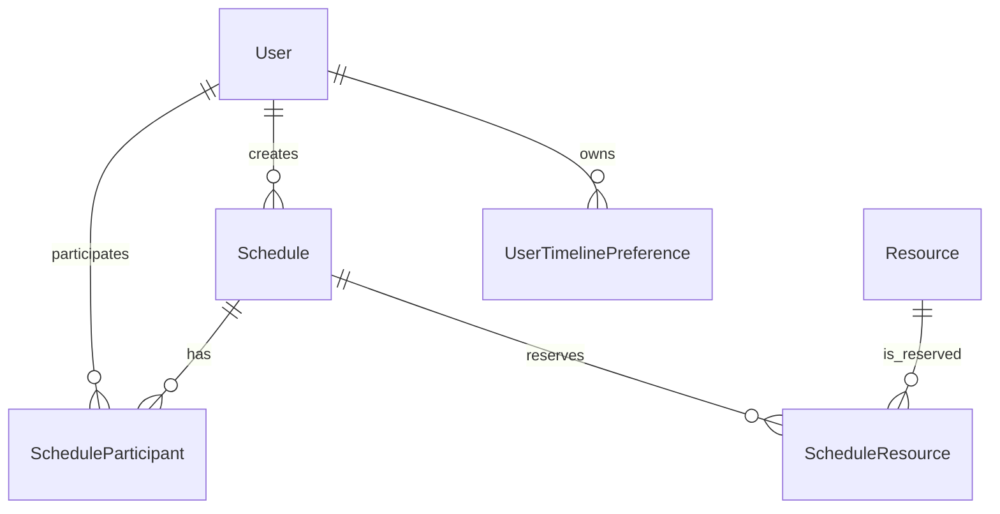

# kobareo-calendar MVP設計

## 構成

Domain は時間範囲、競合、レーン割当などの業務規則、Application は閲覧者別の秘匿とユースケース、Infrastructure は永続化とIdentity、WebApp はHTTP境界とReact静的配信を担当する。クライアントUIは React + TypeScript とし、API日時はUTC、画面表示は `Asia/Tokyo` を既定とする。

## データモデル

`User` と `Resource` は物理削除せず、`IsActive = false` をアーカイブ済みとして扱う。ユーザーのアーカイブ後はログインと新しい予定への追加を禁止し、会議室・備品のアーカイブ後は新しい予約を禁止する。一方、過去の予定、名称、既存のタイムライン表示設定は履歴として保持する。管理者はアーカイブ済みのユーザー、会議室、備品を利用中へ復元できる。関連外部キーは Restrict、予定は楽観ロック用 `Version` を持つ。検索範囲は最大31日とし、予定の `(StartsAtUtc, EndsAtUtc)` と各関連先IDへ索引を置く。

## API・セキュリティ

- Cookie認証は `HttpOnly`、`Secure`、`SameSite=Strict`。本番は `__Host-` Cookieを同一オリジンのリバースプロキシ経由で利用する。
- Cookie認証の更新APIには二重送信トークン方式のCSRF保護を追加する。CORSは本番で許可オリジンを限定し、ワイルドカードと資格情報を併用しない。
- 非公開情報はApplication層でDTO化する際に秘匿する。更新・削除は作成者またはAdminに限定する。
- 競合条件は `new.Start < existing.End && existing.Start < new.End`。409応答後に `confirmConflicts=true` を明示した要求だけを許可する。永続化時にはトランザクション内で再検査する。

Identity、ユーザー、リソース、予定はEF Coreで永続化し、開発環境ではSQLiteを使用する。プロバイダーは `DATABASE_PROVIDER` で切り替える。コミット済みマイグレーションはSQLite用であり、SQL Server本番適用時は対象バージョン向けスクリプトを生成・レビューして移行ジョブから適用する。

API契約はASP.NET Core OpenAPIから `/api/openapi/v1.json` に生成する。ログインにはIP単位のレート制限とIdentityロックアウトを併用し、APIと静的画面にはCSP、`X-Content-Type-Options`、`X-Frame-Options`、Referrer Policy、Permissions Policyを付与する。

## 予定の整合性

予定、参加ユーザー、予約リソースはSQLiteへ永続化する。作成・更新ではSerializableトランザクション内で対象の重複を再検査し、競合がある通常要求には409を返す。同じ内容を `confirmConflicts=true` で明示再送信した場合だけ保存する。更新・削除は作成者またはAdminに限定し、`Version` による楽観的排他制御を行う。非公開予定はAPI DTO生成時に閲覧者を判定し、権限がなければ題名を「非公開の予定」、詳細をnullにする。

## タイムライン表示設定

`UserTimelinePreference` は所有ユーザー、対象ユーザーまたは対象リソース、混在順序を保持する。自分自身はDB行へ保存せず、API応答の先頭へ必ず補完するため削除できない。アーカイブ済みユーザー、会議室、備品は新しい表示対象の候補から除外するが、履歴参照のため既存設定は保持できる。更新時は対象の存在、重複、100件上限を検証する。予定一覧APIは自分自身と指定された表示対象に関連する予定だけを返す。

表示対象は検索結果から明示的に登録し、`IsVisible` により登録状態を維持したままタイムラインへの表示・非表示を切り替える。既存行のマイグレーション時は、従来の表示を維持するため `IsVisible = true` とする。

## 通知

予定の作成者が自分以外のユーザーを参加者に指定した場合、または更新で新しく参加者へ追加した場合、受信者ごとに `Notification` を作成する。通知は作成者名、予定名、作成日時、既読状態を保持し、WebSocketの予定変更イベントを契機にクライアントが即時再取得する。通知APIはログインユーザー自身の通知だけを取得・既読化できる。予定を削除した場合は対応する通知も削除する。
